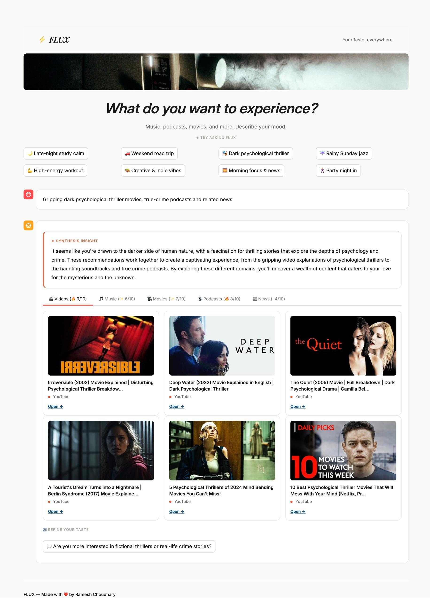
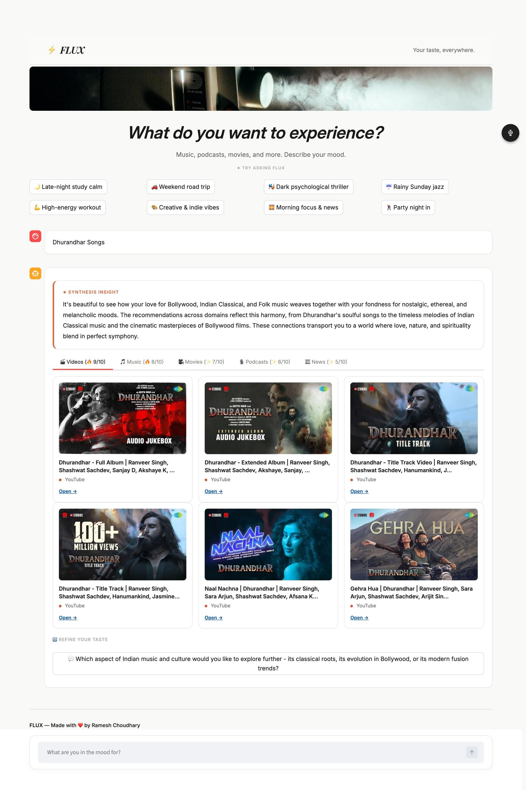

# ⚡ FLUX

> Your taste, everywhere.




FLUX is a cross-domain AI recommendation engine. You drop what you're in the mood for into the chat, and it figures out exactly what media you should experience. By hooking into YouTube, iTunes, TMDB, and DuckDuckGo, it strings together videos, music, movies, podcasts, and news into one cohesive synthesis. 

We threw out the standard Streamlit UI and injected a custom, editorial layout—heavy on Playfair Display, Inter, and Anthropic-inspired colors—because your tools should look as good as they work.

### The Stack
- **UI:** Streamlit with custom CSS.
- **Agent:** LangGraph.
- **LLM:** Groq (Llama 3) with Gemini fallback via OpenRouter.
- **Search:** YouTube, iTunes, TMDB, and DuckDuckGo scraping.

---

### Quick Start

1. **Clone & Setup:**
   ```bash
   cd flux
   pip install -r requirements.txt
   pip install ddgs  # required for the fallback scraper
   ```

2. **Keys:**
   Copy `.env.example` to `.env` and drop in your API keys. 
   *(Note: You can skip YouTube and TMDB keys. FLUX will just fall back to DuckDuckGo scraping automatically).*
   - `GROQ_API_KEY`
   - `OPENROUTER_API_KEY` (optional backup)
   - `GOOGLE_API_KEY` (optional)
   - `TMDB_API_KEY` (optional)

3. **Run It:**
   ```bash
   make start
   ```
   Drop into `http://localhost:8501` and start typing.

## Production Setup

.PHONY: install start stop

start:
	@pip install -r flux/requirements.txt --quiet
	@python3 -m streamlit run flux/app.py

stop:
	@pkill -f streamlit || true

install:
	@python3 -m venv .venv
	@.venv/bin/pip install -r flux/requirements.txt
